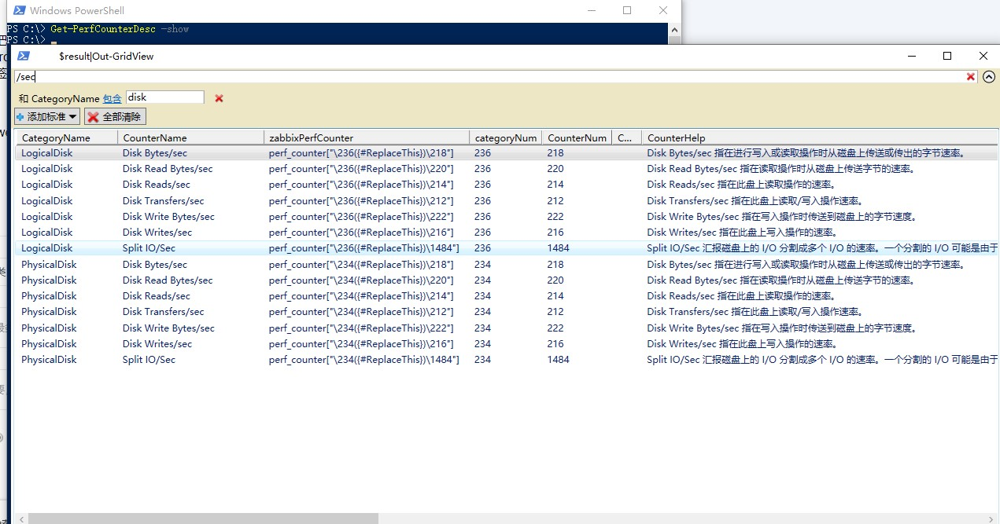
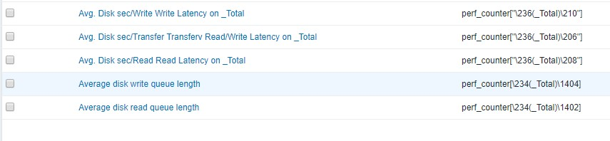
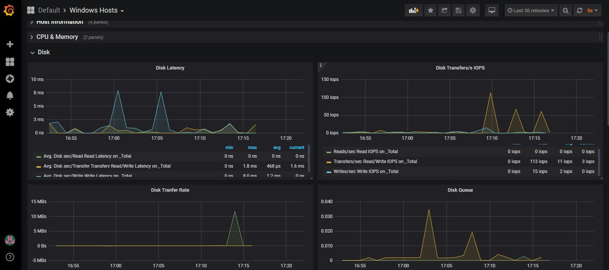

## Windows Performance Counter Monitor With Zabbix and Grafana

- [用来列举当前系统中所有性能计数器及解释、同时生成zabbix 中对应的key](Get-PerfCounterDesc.ps1) 

- [Grafana 模板，用来显示windows 主机的各种状态，数据取自zabbix,且使用grafana-zabbix插件](Grafana-windows-host-template.json)

- [修改后的zabbix 模板windows os template 包含磁盘相关的关于iops 及Latency 的性能计数器](zbx_export_windows_os_template-added-disk-latency-and-iops-counters.xml)

